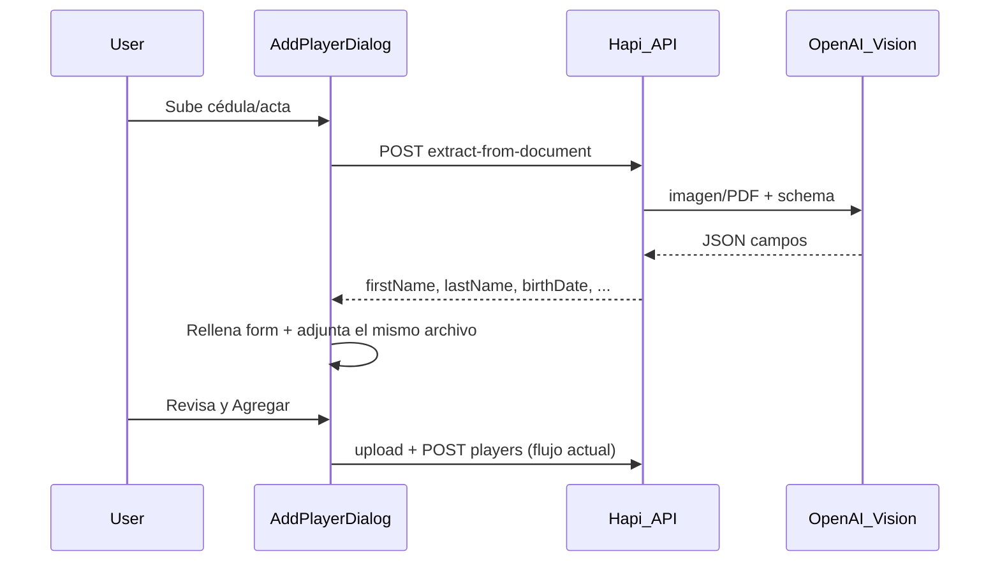

---
todos:
  - id: backend-extract-service
    status: completed
    content: Servicio OpenAI Vision + normalización de campos y env OPENAI_API_KEY
  - id: backend-route
    status: completed
    content: 'POST /teams/{id}/players/extract-from-document + Joi + i18n API'
  - id: frontend-api-ui
    status: completed
    content: Cliente API + bloque Autocompletar en diálogo Agregar jugador + i18n
  - id: tests
    status: completed
    content: Tests unitarios del normalizador de extracción
name: AI autofill jugador
overview: 'Agregar extracción con OpenAI Vision al diálogo de “Agregar jugador”: el usuario sube foto/PDF de cédula, pasaporte o acta de nacimiento y el backend rellena nombre, fecha de nacimiento, tipo/número de documento y, si aplica, datos del encargado; el usuario revisa y guarda como hoy.'
isProject: false
---
# Autocompletar jugador desde documento (AI)

## Contexto actual

En [TeamDetailPage.tsx](web/src/shared/components/TeamDetailPage/TeamDetailPage.tsx) el alta ya pide `firstName`, `lastName`, fecha de nacimiento, categoría, tipo/número de documento, encargado y archivos. Los docs se suben con `uploadPlayerFile` → [uploadService.ts](api/src/services/uploadService.ts). **No hay OCR ni AI** en el repo.

Campos que la IA puede completar (alineados al modelo `Player`):

| Documento | Campos |
|-----------|--------|
| Cédula / pasaporte / DIMEX (`player_id_copy`) | `firstName`, `lastName`, `birthDate`, `idDocumentType`, `idDocumentNumber` |
| Acta de nacimiento (`birth_certificate`) | `firstName`, `lastName`, `birthDate` (+ encargado si aparece) |
| Cédula del encargado (`guardian_id_copy`) | `guardianName`, `guardianIdNumber` |

`tournamentAgeCategoryId` se infiere en el cliente a partir de `birthDate` y las categorías del torneo (misma lógica que ya usa el form).

## Decisión técnica (default)

- **Proveedor:** OpenAI `gpt-4o` con salida JSON estructurada (Vision para imágenes; PDF vía input de archivo o primera página).
- **Alcance UI:** diálogo **Agregar jugador** (reutilizable después en perfil/edición).
- **Clave:** solo en el API (`OPENAI_API_KEY`); nunca en el frontend.
- El usuario **siempre revisa** los campos antes de guardar; la IA no crea el jugador sola.



## Backend

1. **Dependencia:** `openai` en [api/package.json](api/package.json).
2. **Servicio** nuevo [api/src/services/documentExtractionService.ts](api/src/services/documentExtractionService.ts):
   - Entrada: `fileBase64`, `mimeType`, `fileName`, `documentHint` (`player_id_copy` | `birth_certificate` | `guardian_id_copy` | `auto`).
   - Prompt en español/CR: documentos costarricenses (cédula nacional/residencia, pasaporte, DIMEX, actas).
   - Respuesta tipada, p. ej.:
     ```ts
     {
       firstName?, lastName?, birthDate?, // YYYY-MM-DD
       idDocumentType?, // cedula_nacional | cedula_residencia | pasaporte | dimex
       idDocumentNumber?,
       guardianName?, guardianRelation?, guardianIdNumber?,
       documentDetected?, // hint confirmado
       confidence?: 'high' | 'medium' | 'low'
     }
     ```
   - Validar/normalizar: fechas ISO, `idDocumentType` solo valores de [player.ts](web/src/shared/constants/player.ts), números sin basura.
   - Errores claros si no hay `OPENAI_API_KEY`, archivo inválido, o no se pudo leer.
3. **Ruta** en [teamRoutes.ts](api/src/teams/teamRoutes.ts):
   - `POST /teams/{id}/players/extract-from-document`
   - Misma auth/acceso que upload/add player.
   - Payload Joi (junto a `playerUploadPayload` en [schemas/index.ts](api/src/schemas/index.ts)): `fileBase64`, `fileName`, `mimeType`, `documentHint` opcional.
   - Límite ~15MB (igual que upload). Tipos: JPEG/PNG/WebP/GIF + PDF.
4. **Config:** `OPENAI_API_KEY` (y opcional `OPENAI_MODEL`) en [api/.env.example](api/.env.example) y [environment.ts](api/environment.ts).
5. **i18n API** mensajes en [api/src/i18n/locales/es.json](api/src/i18n/locales/es.json) / `en.json`.
6. **Tests unitarios** del normalizador (mapeo de tipos de doc, fechas) sin llamar a OpenAI.

## Frontend

1. **API client** en [teams.ts](web/src/shared/api/teams.ts): `extractPlayerFromDocument(teamId, payload)`.
2. **UI en el diálogo Agregar jugador** ([TeamDetailPage.tsx](web/src/shared/components/TeamDetailPage/TeamDetailPage.tsx)):
   - Bloque arriba: “Autocompletar desde documento” + `FileUploadButton` (imagen/PDF) + botón “Rellenar con AI”.
   - Al éxito: setear estados del form (`playerFirstName`, etc.); si el hint es ID/acta/encargado, también asignar ese archivo a `playerDocIdFile` / `playerDocBirthFile` / `playerDocGuardianFile` para no subir dos veces.
   - Estados: loading, error, aviso de confianza baja (“Revisa los datos”).
   - Tras `birthDate`, si hay categorías de edad, auto-seleccionar la que corresponda al año de nacimiento.
3. **i18n** claves nuevas en [es.json](web/src/shared/i18n/locales/es.json) / [en.json](web/src/shared/i18n/locales/en.json).

## Seguridad y producto

- No loguear base64 ni PII completa; solo errores genéricos + correlator.
- Extracción auth-protegida; la clave OpenAI solo server-side.
- No persistir el archivo solo por extracción: si el usuario confirma el alta, se usa el flujo upload existente.

## Fuera de alcance (esta iteración)

- Editar/perfil del jugador (el endpoint queda listo para reutilizar).
- Extraer foto del rostro de la cédula como `photoUrl` del jugador.
- Word (.doc/.docx) para AI (sigue pudiendo adjuntarse sin OCR).
- Cache/historial de extracciones.
